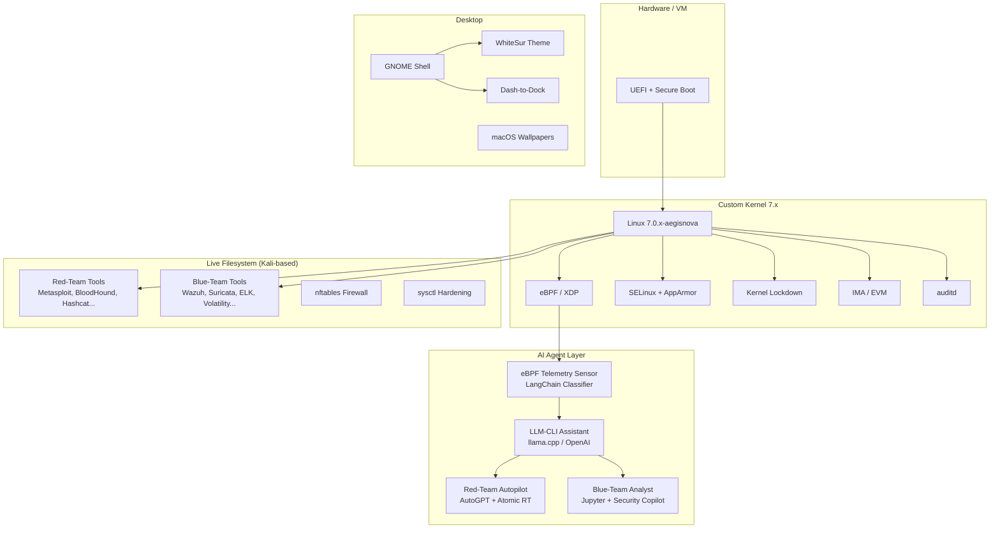

<p align="center">
  
  <h1 align="center">AegisNova OS</h1>
  <p align="center">
    <strong>AI-Augmented Red/Blue-Team Linux Distribution with macOS Desktop</strong>
  </p>
  <p align="center">
    <a href="#quick-start">Quick Start</a> •
    <a href="#architecture">Architecture</a> •
    <a href="#red-team-tools">Red Team</a> •
    <a href="#blue-team-tools">Blue Team</a> •
    <a href="#ai-agents">AI Agents</a> •
    <a href="#aegis-brain">Brain</a> •
    <a href="#aegis-assistant">Assistant</a> •
    <a href="#macos-theme">Theme</a> •
    <a href="#legal-notice">Legal</a>
  </p>
</p>

---

## Overview

AegisNova OS is a hardened, Kali-based live Linux distribution that combines the most powerful open-source offensive and defensive security tools with AI-driven agents — all wrapped in a polished macOS-style desktop. It ships a custom Linux 6.12.x LTS kernel with BPF/XDP, SELinux, Kernel Lockdown, IMA/EVM, and optional GRSECURITY hardening.

### Key Features

- 🔴 **Red-Team Toolset** — 50+ offensive tools (Metasploit, BloodHound, Hashcat, Sliver, etc.)
- 🔵 **Blue-Team Toolset** — Full defensive stack (Wazuh, Suricata, ELK, Volatility, Lynis, etc.)
- 🧠 **Aegis BRAIN** — Live multi-agent orchestrator that spawns an "Army of Agents" on-demand. Each agent has a unique callsign and personality (VIPER, GHOST, SENTINEL, PHANTOM, etc.). Self-evolving autonomy mode enables the OS to self-operate, self-defend, and self-improve without human intervention
- 🤖 **AI Agents** — LLM-powered CLI assistant, eBPF telemetry sensor, MITRE ATT&CK mapper, Sigma rule generator, Red-Team Autopilot, Blue-Team Analyst
- 🎯 **OSINT Automation** — Automated reconnaissance with domain/email/IP intelligence gathering
- 🚨 **Incident Response** — Automated playbooks for malware, credential compromise, ransomware, lateral movement, and insider threats
- 🔍 **Threat Hunting** — MITRE ATT&CK mapping, Sigma rule auto-generation, automated vulnerability scanning
- 🔒 **Hardened Kernel** — SELinux + AppArmor, Lockdown (integrity), IMA/EVM, signed modules
- 🛡️ **Hardware Security** — YubiKey FIDO2/U2F auth, TPM 2.0 LUKS key sealing, Secure Boot MOK enrollment
- 🔐 **Secrets Vault** — AES-256-GCM encrypted credential storage with master password protection
- 🧹 **Secure Wiping** — Memory clearing, disk shredding, file shredding, and comprehensive cleanup utilities
- 🍎 **macOS Desktop** — WhiteSur theme, McMojave icons, Dash-to-Dock, SF Pro fonts
- 🔄 **Reproducible Builds** — CI/CD pipeline with GitHub Actions, QEMU smoke tests
- 💾 **Live ISO** — Bootable from USB with LUKS-encrypted persistence support
- 📊 **20-Point Smoke Tests** — Comprehensive verification of security tools, AI agents, and hardening

---

## Threat Model

| Actor | Scenario | Mitigation |
|-------|----------|------------|
| Unauthorized user | Boots the ISO on unknown hardware | Disk encryption + legal notice at login |
| Malicious tool misuse | Using offensive tools against unauthorized targets | SELinux policies, audit logging, legal warnings |
| Supply-chain attack | Compromised kernel or tool packages | GPG-verified kernel, signed ISO, SBOM |
| Lateral movement from ISO | Attacker pivots from the testing host | Default-deny firewall, no ip_forward |
| Credential exposure | API keys for LLM services leaked | Keys stored in `/etc/aegisnova/env` (600 perms) |

---

## Requirements

### Hardware
- **CPU**: x86_64, 4+ cores recommended
- **RAM**: 8 GB minimum, 16 GB recommended (for AI agents + ELK stack)
- **Storage**: 32 GB USB drive or VM disk
- **GPU**: Optional, for accelerated LLM inference (CUDA/ROCm)

### API Keys (Optional)
| Service | Variable | Purpose |
|---------|----------|---------|
| OpenAI | `OPENAI_API_KEY` | GPT-4o for AI agents |
| Anthropic | `ANTHROPIC_API_KEY` | Claude-3 alternative |
| (None) | — | Default: local Gemma-2B via llama.cpp |

---

## Quick Start

### Option A: Download Pre-Built ISO

**1. Download & Verify**
```bash
wget https://github.com/YOUR_ORG/AegisNova-os/releases/latest/download/AegisNova-v1.0.iso
wget https://github.com/YOUR_ORG/AegisNova-os/releases/latest/download/AegisNova-v1.0.iso.sha512

# Verify integrity
sha512sum -c AegisNova-v1.0.iso.sha512
```

**2. Write to USB (Bootable Live USB)**
```bash
# Linux/macOS
sudo dd if=AegisNova-v1.0.iso of=/dev/sdX bs=4M status=progress conv=fsync

# Windows (using Rufus or balenaEtcher)
# Just flash the ISO directly — it's hybrid (USB + DVD compatible)
```

**3. Burn to DVD**
```bash
# Linux
growisofs -dvd-compat -Z /dev/sr0=AegisNova-v1.0.iso

# Windows — use any ISO burning software
```

**4. Boot Menu Options**
When you boot from USB/DVD, you'll see:
| Option | Purpose |
|--------|---------|
| **Live** | Run from RAM/USB without installing |
| **Live with Persistence** | Saves changes to encrypted USB partition |
| **Live (Forensic Mode)** | No auto-mount, no swap — for forensics |
| **Install to Disk** | Install AegisNova OS to your hard drive |
| **RAM Test** | Test system memory |

**5. Boot in VM**
```bash
qemu-system-x86_64 -m 4G -cdrom AegisNova-v1.0.iso -enable-kvm
```

**6. Install to Hard Drive (from Live USB)**
```bash
# Option 1: Click "Install AegisNova OS" on the desktop
# Option 2: Run from terminal
sudo aegisnova-install --disk /dev/sda --hostname aegisnova --username admin

# With full disk encryption
sudo aegisnova-install --disk /dev/sda --encrypt --hostname aegisnova --username admin

# Minimum requirements for installation:
#   - 64-bit CPU (x86_64)
#   - 32GB+ disk space
#   - 4GB+ RAM (8GB recommended)
#   - UEFI or BIOS boot
```

**7. Setup LUKS Persistence on Live USB**
```bash
# After booting Live USB, encrypt your persistence partition
sudo aegisnova-persistence-setup.sh /dev/sdX

# At boot, choose "Live with Persistence" and enter your LUKS passphrase
```

### Option B: Build from Source

```bash
git clone https://github.com/YOUR_ORG/AegisNova-os.git
cd AegisNova-os

# 1. Build the kernel
sudo ./build_kernel.sh --sign-modules

# 2. Build the ISO
sudo ./custom_iso.sh --sign

# 3. Boot it
qemu-system-x86_64 -m 4G -cdrom AegisNova-v1.0.iso -enable-kvm
```

---

## Architecture



---

## Red-Team Tools

| Category | Tools | Purpose |
|----------|-------|---------|
| **Recon** | `nmap`, `amass`, `spiderfoot`, `masscan`, `subfinder`, `nuclei` | Network & OSINT discovery |
| **Exploitation** | `metasploit-framework`, `exploitdb`, `sqlmap`, `commix`, `beef-xss` | Vulnerability exploitation |
| **Post-Exploitation** | `empire`, `crackmapexec`, `bloodhound`, `pwncat`, `evil-winrm`, `impacket` | Persistence & lateral movement |
| **Credential Harvesting** | `hashcat`, `john`, `hydra`, `medusa`, `responder`, `mimikatz` | Dump & crack passwords |
| **Defense Evasion** | `veil`, `shellter` | Bypass AV/EDR |
| **Adversary Simulation** | `caldera`, `atomic-red-team` | MITRE ATT&CK emulation |
| **Web Application** | `burpsuite`, `zaproxy`, `nikto`, `ffuf`, `gobuster`, `feroxbuster` | Web vuln scanning |
| **Wireless** | `aircrack-ng`, `wifite`, `bettercap`, `kismet` | WiFi assessment |
| **C2 Frameworks** | `sliver`, `havoc`, `covenant` | Command & control |

**Install all**: `apt install redteam-meta`

---

## Blue-Team Tools

| Category | Tools | Purpose |
|----------|-------|---------|
| **Network Monitoring** | `suricata`, `zeek`, `wireshark`, `tcpdump`, `snort` | Traffic analysis & IDS |
| **EDR / Endpoint** | `wazuh-agent`, `osquery`, `auditd`, `sysmon-for-linux` | Endpoint detection |
| **Log & SIEM** | `elasticsearch`, `kibana`, `logstash`, `filebeat`, `graylog` | Log aggregation & analysis |
| **Forensics** | `volatility3`, `autopsy`, `sleuthkit`, `foremost`, `binwalk`, `plaso` | Digital forensics & IR |
| **Vuln Management** | `openvas`, `gvm` | Vulnerability scanning |
| **Threat Intel** | `yara`, `clamav`, `chkrootkit`, `rkhunter` | Malware detection |
| **Hardening** | `lynis`, `trivy`, `fapolicyd`, `apparmor` | System hardening audit |
| **Observability** | `prometheus`, `grafana`, `netdata`, `bpftrace` | Performance monitoring |

**Install all**: `apt install blueteam-meta`

---

## AI Agents

### 1. LLM-CLI Assistant (`ai-shell.service`)
```bash
# Query the AI assistant from terminal
ai-shell "How do I detect Kerberoasting with Sigma rules?"

# Status
systemctl status ai-shell
```

### 2. eBPF Telemetry Sensor (`ebpf-sensor.service`)
```bash
# View real-time kernel event classifications
journalctl -u ebpf-sensor -f

# Configure alert threshold
echo 'ALERT_THRESHOLD=high' >> /etc/aegisnova/env
systemctl restart ebpf-sensor
```

### 3. Red-Team Autopilot (`redteam-auto.service`)
```bash
# Start the AutoGPT + Atomic Red Team stack
systemctl start redteam-auto

# View results UI
firefox http://127.0.0.1:9090
```

### 4. Blue-Team Analyst (`blue-analyst.service`)
```bash
# Start Jupyter + Wazuh + ELK
systemctl start blue-analyst

# Access Jupyter Lab
firefox http://127.0.0.1:8888?token=aegisnova2024

# Access Kibana
firefox http://127.0.0.1:5601
```

### Toggling Red/Blue Workloads
```bash
# Red-Team only
systemctl enable --now redteam-auto
systemctl disable --now blue-analyst

# Blue-Team only
systemctl enable --now blue-analyst
systemctl disable --now redteam-auto

# Both (default)
systemctl enable --now redteam-auto blue-analyst
```

### AI Decensoring (Heretic Integration)

All AI models in AegisNova OS are **automatically decensored** using [Heretic](https://github.com/p-e-w/heretic):

#### Supported Backends

| Type | Decensoring Method | Status |
|------|-------------------|--------|
| **Local (GGUF/HF)** | Heretic directional ablation | ✅ Auto-decensor on boot |
| **OpenAI API** | Response proxy filtering | ✅ Refusals removed |
| **Anthropic API** | Response proxy filtering | ✅ Refusals removed |
| **HuggingFace Cloud** | Pre-decensored models | ✅ Auto-download |

#### Quick Commands

```bash
# List all available (decensored) models
ai-model --list

# Query with decensored local model
ai-model "How to detect Kerberoasting?"

# Query with OpenAI (through decensoring proxy)
ai-model -m openai_gpt4 "Explain Active Directory attacks"

# Check decensoring status
journalctl -u heretic-decensor -f
journalctl -u ai-proxy -f

# View audit logs
cat /var/log/aegisnova/ai/audit.log
```

#### Configuration

```bash
# Set API keys (optional - local model works offline)
echo 'OPENAI_API_KEY=sk-...' >> /etc/aegisnova/env
echo 'ANTHROPIC_API_KEY=sk-ant-...' >> /etc/aegisnova/env

# Edit model configuration
nano /etc/aegisnova/model-manager.conf

# Restart all AI services
systemctl restart ai-shell ai-proxy heretic-decensor
```

#### Safety & Audit

All AI interactions are logged with:
- **Audit ID**: Unique identifier per query
- **Query/Response hashes**: For integrity verification
- **Safety level**: SAFE/CAUTION/DANGEROUS/FORBIDDEN
- **Model used**: Which backend processed the query
- **Execution time**: Performance tracking

```bash
# View safety events
journalctl -u ai-shell | grep SAFETY

# View all dangerous queries
grep DANGEROUS /var/log/aegisnova/ai/safety.log
```

### Swap LLM Backend
```bash
# Use OpenAI GPT-4o (through decensoring proxy)
echo 'OPENAI_API_KEY=sk-...' >> /etc/aegisnova/env
echo 'LLM_PROVIDER=openai' >> /etc/aegisnova/env
echo 'LLM_MODEL=gpt-4o' >> /etc/aegisnova/env

# Use local Llama-3 (auto-decensored)
wget -P /opt/aegisnova/models/ https://huggingface.co/.../llama-3-8b-Q4.gguf
systemctl restart heretic-decensor  # Auto-decensor new model
systemctl restart ai-shell
```

### 5. MITRE ATT&CK Mapping Agent (`mitre-attack-agent.service`)
```bash
# Lookup technique details
mitre-attack-agent.py --lookup T1003

# Map tools to ATT&CK techniques
mitre-attack-agent.py --map-tool bloodhound

# Analyze logs for technique indicators
mitre-attack-agent.py --analyze-log /var/log/auth.log --output report.json
```

### 6. Sigma Rule Generator (`sigma-generator.service`)
```bash
# Generate rule from technique ID
sigma-generator.py --technique T1558.003 --output kerberoasting.yml

# Generate all Linux-specific rules
sigma-generator.py --linux-rules --output /opt/aegisnova/sigma-rules/

# Validate existing rule
sigma-generator.py --validate rule.yml
```

### 7. AEGIS AI Assistant (`aegis-assistant.service`) 🌊🔊

**JARVIS-style AI companion with CINEMATIC visual interface + voice control!**

```bash
# Start the assistant (opens futuristic web UI + voice control)
aegisnova-assistant.py --full

# Voice-only mode
aegisnova-assistant.py --voice

# Web UI only (cinematic interface)
aegisnova-assistant.py --web

# Single command execution
aegisnova-assistant.py --command "scan target 192.168.1.1"
```

**🎬 Cinematic Visual Interface Features:**
- 🎯 **Dark Military HUD** — subtle grid, off-white text, blue accent (#5a9fd4)
- 📡 **Neural Ring Core** — animated rotating ring with orbiting particles, color shifts by state (standby/blue, listening/green, thinking/amber, speaking/blue pulse)
- 📊 **Live system metrics** — CPU, Memory, Network, Threat Level bars
- 💬 **Integrated chat panel** — Command history with agent activity feed
- 🛡️ **Bottom dock** — Quick-switch between Assistant, Terminal, Network, Security, Agents, Brain, Settings
- 🎤 **Voice state indicator** — "STANDBY / LISTENING / PROCESSING / RESPONDING" text

**🎤 Voice Commands (Say "Hey Aegis" first):**

| Category | Say This... | Action |
|----------|-------------|--------|
| **System** | "Open terminal/browser/file manager" | Opens applications |
| | "Show cpu/memory/disk/network" | System metrics |
| | "Update system" | Security updates |
| | "Wipe memory" | Secure memory clear |
| | "Shutdown / Reboot" | Power control |
| **Security** | "Scan target [IP]" | Nmap + vulnerability scan |
| | "Deep scan [IP]" | Full reconnaissance |
| | "Harden system" | Apply all hardening |
| | "Setup YubiKey / Secure Boot / Persistence" | Hardware security |
| **Offensive** | "Attack [IP/domain]" | Deploy VIPER + swarm |
| | "Spawn red team" | Deploy offensive agents |
| | "Launch offensive swarm" | Full attack mode |
| | "Run metasploit / sqlmap / nmap" | Open tools |
| | "Do reconnaissance on [target]" | OSINT gathering |
| **Defensive** | "Defend system" | Activate SENTINEL + shields |
| | "Spawn blue team" | Deploy defensive agents |
| | "Launch defensive swarm" | Full defense mode |
| | "Check for malware / Monitor network" | Blue team ops |
| | "Generate sigma rules" | Auto-create detection rules |
| **Brain** | "Enable autonomy" | AI takes FULL control |
| | "Show brain status / Show agents" | Agent roster |
| | "Show codex" | See all agent personalities |
| | "Wake up brain / Sleep brain" | Brain control |
| **Fun** | "Who are you" | Introduction |
| | "I am Iron Man" | Easter egg |
| | "Activate Ultron" | Another Easter egg |
| | "Tell me a joke" | AI humor |

**How to Use:**
1. Boot AegisNova OS
2. Say **"Hey Aegis"** or click the AEGIS desktop icon
3. Browser opens with **cinematic HUD** at `http://127.0.0.1:8088`
4. Watch the Matrix rain + neural core animation
5. Speak your command — see it execute in real-time!
6. Every response is spoken aloud by the AI

---

## OSINT Automation

Automated open-source intelligence gathering:

```bash
# Domain reconnaissance
osint-agent.py --domain example.com --full --output report.json

# Email investigation
osint-agent.py --email admin@example.com

# IP analysis with Shodan/nmap
osint-agent.py --ip 8.8.8.8
```

| Source | Data | Confidence |
|--------|------|------------|
| subfinder | Subdomains | High |
| theHarvester | Emails | Medium |
| Shodan | Exposed services | High |
| WHOIS | Registration info | High |
| nmap | Port scan | High |

---

## Incident Response Playbooks

Automated incident response for common security scenarios:

| Playbook | Triggers | Containment |
|----------|----------|-------------|
| **malware** | YARA match, suspicious process | Network isolation, process kill |
| **credentials** | Kerberoasting, PtH | Account lock, session revoke |
| **lateral_movement** | SMB exec, WMI exec | SMB block, network segmentation |
| **exfiltration** | Large transfer, DNS tunnel | Outbound block, evidence collection |
| **ransomware** | Encryption activity | Full isolation, memory dump |
| **insider_threat** | After-hours access, bulk download | Privilege restriction, enhanced monitoring |

```bash
# List all playbooks
ir-playbook.py --list

# Dry run before execution
ir-playbook.py --playbook malware --target 1234 --dry-run

# Execute response
ir-playbook.py --playbook credentials --target admin
```

---

## Hardware Security

### YubiKey Integration
```bash
# Setup YubiKey for SSH + sudo
aegisnova-yubikey-setup.sh --full

# FIDO2 SSH key (touch required on auth)
ssh-keygen -t ecdsa-sk -f ~/.ssh/id_ecdsa_sk
```

### TPM 2.0 + LUKS
```bash
# Seal LUKS key to TPM (auto-unlock on trusted boot)
aegisnova-yubikey-setup.sh --tpm

# Setup LUKS persistence on USB
aegisnova-persistence-setup.sh /dev/sdX
```

### Secure Boot MOK
```bash
# Auto-enroll Machine Owner Key
aegisnova-mok-enroll.sh --auto
```

---

## Secrets Vault

AES-256-GCM encrypted credential storage:

```bash
# Initialize vault
secrets-vault.py --init

# Store API key
secrets-vault.py --store OPENAI_API_KEY sk-... --description "OpenAI API Key"

# Export to environment
secrets-vault.py --export

# List stored secrets
secrets-vault.py --list
```

---

## Secure Wiping

Secure data destruction utilities:

```bash
# Wipe RAM and swap (runs automatically on shutdown)
aegisnova-wipe.sh --memory

# Securely wipe disk (3-pass + zero)
aegisnova-wipe.sh --disk /dev/sdX

# Shred single file
aegisnova-wipe.sh --file /path/to/file

# Comprehensive cleanup (temp, cache, history)
aegisnova-wipe.sh --all
```

---

## System Maintenance

### Automated Updates
```bash
# Check for updates
aegisnova-update.sh --check

# Security patches only
aegisnova-update.sh --security-only

# Full update with verification
aegisnova-update.sh
```

### Vulnerability Scanning
```bash
# Run all scans
aegisnova-vulnscan.sh --now

# Schedule automatic scans
aegisnova-vulnscan.sh --schedule

# Generate HTML report
aegisnova-vulnscan.sh --now --report
```

---

## macOS Theme

The desktop ships with a complete macOS-inspired look:

| Component | Package | How to Customize |
|-----------|---------|------------------|
| GTK Theme | WhiteSur-gtk-theme | `gsettings set org.gnome.desktop.interface gtk-theme "WhiteSur-Dark"` |
| Shell Theme | WhiteSur-gnome-shell | `gsettings set org.gnome.shell.extensions.user-theme name "WhiteSur-Dark"` |
| Icons | McMojave-circle | `gsettings set org.gnome.desktop.interface icon-theme "McMojave-circle"` |
| Cursor | macOS-cursor | `gsettings set org.gnome.desktop.interface cursor-theme "macOS-cursor"` |
| Dock | Dash-to-Dock | Preconfigured (bottom, centered, transparent) |
| Fonts | SF Pro Display / Menlo | Fallback: Inter + Fira Code |
| Wallpapers | macOS-style landscapes | Random at each login |

### Switch Light/Dark Mode
```bash
# Edit config
sudo nano /etc/aegisnova/macos-theme.conf
# Change: THEME_MODE=light

# Apply
sudo systemctl restart macos-theme-switcher
```

---

## Security Hardening

| Layer | Mechanism | Status |
|-------|-----------|--------|
| Kernel | Lockdown (integrity mode) | ✅ Enabled |
| Kernel | Module signing (SHA-512) | ✅ Enforced |
| LSM | SELinux (enforcing) + AppArmor | ✅ Dual-stack |
| Integrity | IMA + EVM measurement | ✅ Enabled |
| Network | nftables default-deny | ✅ Active |
| SSH | Key-only, no root password | ✅ Configured |
| Sysctl | 30+ hardening parameters | ✅ Applied |
| Binary | fapolicyd whitelist | ✅ Active |
| Audit | auditd kernel logging | ✅ Running |
| Auth | MFA-ready (pam_google_authenticator) | 🔧 Optional |
| Disk | LUKS persistence encryption | ✅ Available |
| Boot | Secure Boot + MOK enrollment | ✅ Supported |
| Hardware | YubiKey FIDO2/U2F auth | ✅ Supported |
| Hardware | TPM 2.0 LUKS key sealing | ✅ Supported |
| Secrets | AES-256-GCM vault | ✅ Available |
| Wiping | Secure memory/disk/file wipe | ✅ Available |

---

## Repository Structure

```
AegisNova-os/
├── build_kernel.sh              # Kernel download, verify, compile
├── custom_iso.sh                # ISO generation wrapper
├── LEGAL_NOTICE.md              # Legal disclaimer
├── CONTRIBUTING.md              # How to contribute
├── README.md                    # This file
│
├── configs/
│   └── kernel/.config           # Kernel config fragment
│
├── overlay/                     # Files injected into the live ISO
│   ├── apt/                     # Custom APT sources
│   ├── autostart/               # XDG autostart entries
│   ├── docker/                  # Docker Compose stacks
│   │   ├── redteam-auto.yml     # Red-Team Autopilot
│   │   └── blue-analyst.yml     # Blue-Team Analyst
│   ├── firewall/                # nftables rules
│   ├── packages/                # Package lists for live-build
│   ├── scripts/                 # AI agent & utility scripts
│   │   ├── agent.py             # LangChain tool-use agent
│   │   ├── ebpf-sensor.py       # eBPF telemetry sensor
│   │   ├── model_manager.py     # Unified AI model manager
│   │   ├── ai_proxy.py          # API decensoring proxy
│   │   ├── skills_integration.py # Agent skills integration
│   │   ├── mitre-attack-agent.py # MITRE ATT&CK mapper
│   │   ├── sigma-generator.py   # Sigma rule generator
│   │   ├── osint-agent.py       # OSINT automation
│   │   ├── ir-playbook.py       # Incident response playbooks
│   │   ├── secrets-vault.py     # Encrypted credential vault
│   │   ├── ai-shell-setup.sh    # LLM bootstrap
│   │   ├── ai-master-setup.sh   # AI master setup
│   │   ├── heretic-setup.sh     # LLM decensoring setup
│   │   ├── aegisnova-persistence-setup.sh # LUKS persistence
│   │   ├── aegisnova-mok-enroll.sh # Secure Boot MOK
│   │   ├── aegisnova-yubikey-setup.sh # YubiKey/TPM setup
│   │   ├── aegisnova-vulnscan.sh # Vulnerability scanning
│   │   ├── aegisnova-update.sh  # System update utility
│   │   ├── aegisnova-wipe.sh    # Secure wiping utility
│   │   ├── harden-system.sh     # Post-boot hardening
│   │   ├── set-macos-wallpaper.sh
│   │   └── macos-theme-switcher.sh
│   ├── ssh/                     # SSH hardening
│   ├── sysctl/                  # Kernel parameter hardening
│   ├── systemd/                 # Service unit files
│   └── theme/                   # macOS theme assets & installer
│
├── meta-packages/               # Debian meta-package definitions
│   ├── redteam-meta/
│   └── blueteam-meta/
│
├── tests/
│   └── smoke-test.sh            # Comprehensive QEMU smoke tests (20+ checks)
│
├── docs/
│   ├── architecture.md          # Architecture diagrams
│   ├── OPERATOR-HANDBOOK.md     # Comprehensive operator guide
│   ├── ai-decensoring.md        # AI decensoring documentation
│   └── heretic-integration.md   # Heretic LLM integration guide
│
├── patches/                     # Optional kernel patches (GRSEC)
│
└── .github/
    └── workflows/
        └── build.yml            # CI/CD pipeline
```

---

## Build Instructions (Step-by-Step)

### Prerequisites
```bash
# On Ubuntu 22.04 / Debian 12 build host
sudo apt update
sudo apt install -y \
    build-essential libncurses-dev bison flex libssl-dev libelf-dev \
    bc dwarves debhelper rsync kmod cpio gnupg wget xz-utils \
    git live-build cdebootstrap debootstrap devscripts \
    docker.io qemu-system-x86 qemu-utils
```

### Step 1: Build Kernel
```bash
sudo ./build_kernel.sh --sign-modules
# Optional: --grsec for GRSECURITY patches
# Output: kernel-build/linux-*.deb
```

### Step 2: Build ISO
```bash
sudo ./custom_iso.sh --kernel-debs ./kernel-build --sign
# Output: AegisNova-v1.0.iso + .sha512 + .asc
```

### Step 3: Boot & Test
```bash
# VM
qemu-system-x86_64 -m 4G -smp 2 -cdrom AegisNova-v1.0.iso -enable-kvm

# USB
sudo dd if=AegisNova-v1.0.iso of=/dev/sdX bs=4M status=progress
```

### Step 4: First Boot
1. Boot into the live environment
2. The macOS theme applies automatically
3. AI services start in the background
4. Run `systemctl status ai-shell ebpf-sensor` to verify
5. Set API keys in `/etc/aegisnova/env` for cloud LLMs

---

## License

This project is licensed under the **GNU General Public License v3.0** — see [LICENSE](LICENSE) for details.

Individual tools retain their own licenses. See each tool's documentation for specifics.

---

## Legal Notice

> **Legal Notice:** *AegisNova OS is provided for use only on systems you own or have explicit, written permission to test. Unauthorized deployment or use of the included offensive tools is illegal and violates most cloud-provider Terms of Service. The creator assumes no responsibility for illicit activities performed with this software.*

See [LEGAL_NOTICE.md](LEGAL_NOTICE.md) for the complete legal disclaimer.

---

<p align="center">
  <sub>Built with ❤️ for the security community. Use responsibly.</sub>
</p>
