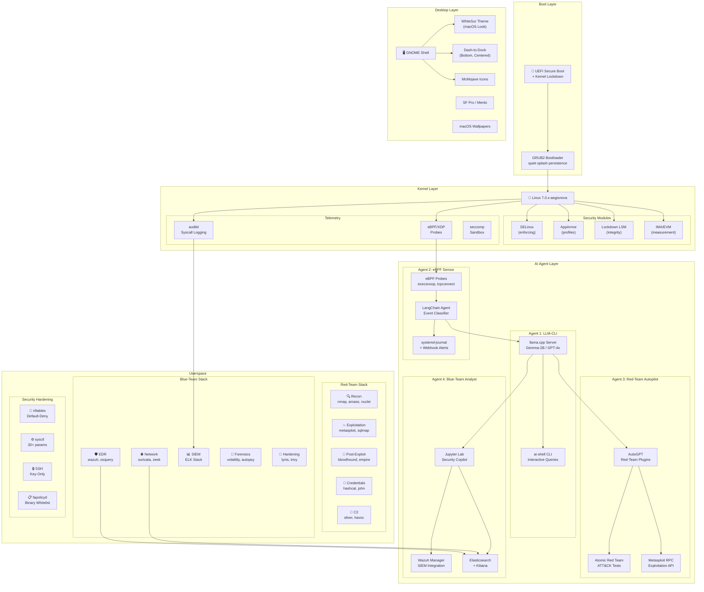
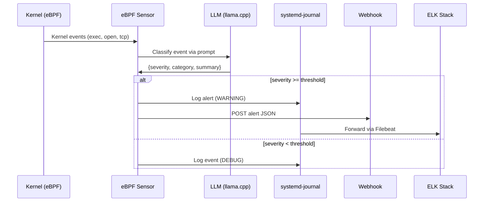
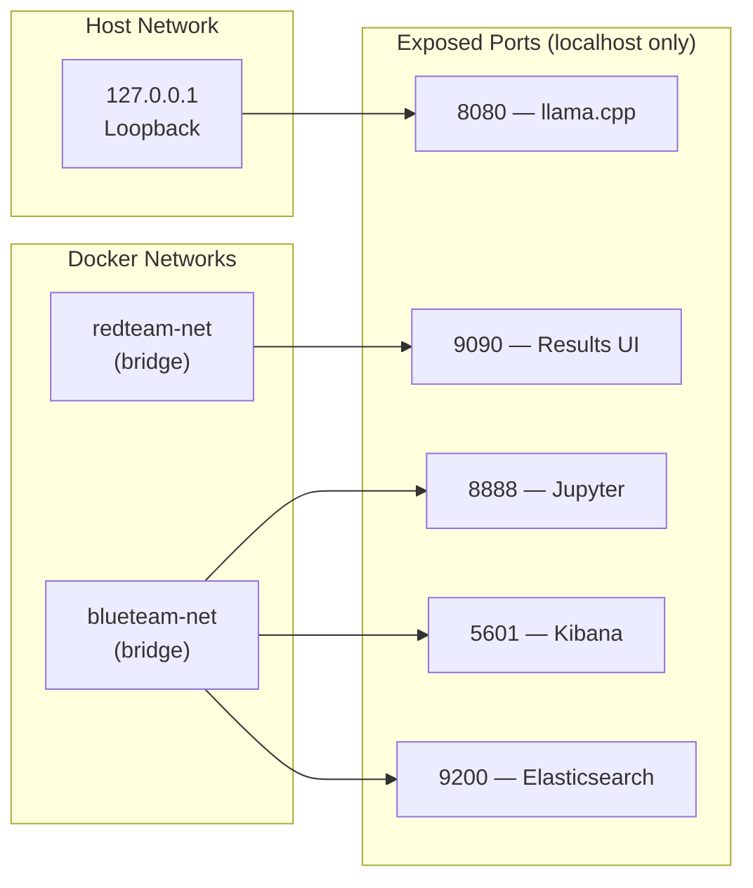

# AegisNova OS — Architecture Documentation

## System Architecture Diagram

## Data Flow

## Network Architecture

## Component Versions

| Component | Version | Source |
|-----------|---------|--------|
| Linux Kernel | 7.0.x | kernel.org |
| Kali Base | Rolling | kali.org |
| llama.cpp | Latest | GitHub |
| Gemma-2B | Q4_K_M | HuggingFace |
| Elasticsearch | 8.13.x | Elastic |
| Wazuh | 4.x | Wazuh |
| WhiteSur Theme | Latest | GitHub (vinceliuice) |
| Docker | CE Latest | Docker |
